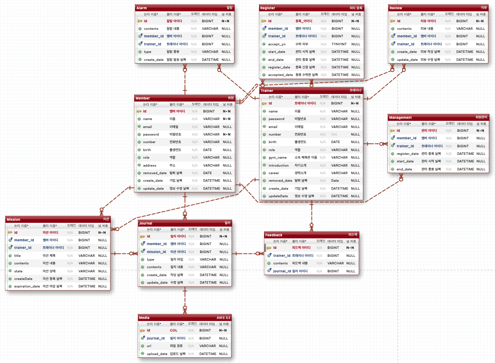

# Gymtopia

## 주제

> **온라인 운동 관리 서비스**
>
> 원하는 트레이너에게 맞춤형 운동을 지도받을 수 있다.
> 트레이너가 미션을 주면 미션에 있는 운동 영상을 참고하며 운동 미션을 수행한다. 수행을 완료한 미션은 영상 및 사진을 일지에 함께 업로드해 트레이너의 피드백을 받고 미션을
> 완료한다.
> 트레이너는 인증한 미션에 대해 피드백을 하여 회원과 소통한다.

## 개발환경

- JDK 17, Spring Boot, MariaDB, Amazon S3, SSE, Spring Data JPA, Hibernate, Lombok

## 기능

### **[회원]**

- **트레이너 선택**

    - 등록되어있는 트레이너 중 원하는 트레이너 선택
    - 트레이너를 검색 가능(Elastic Search 활용)

- **운동 일지 (AWS S3를 사용해여 이미지, 영상 저장)**
    - 일지 작성
        - 그날 운동에 대한 영상과 식단에 대한 사진 등을 일지에 기록
        - 식단이 있다면 식단사진도 함께 게시
        - 그날 운동에 대한 리뷰 작성

    - 일지 확인
        - 지금까지 작성한 운동 일지 확인

  ❗️제약 조건

    - 올릴 수 있는 영상은 1개 이미지는 최대 3개로 제한
    - 운동 일지는 매일 작성해야 한다.
    - 일지는 작성자만 수정, 삭제 할 수 있다.
- **미션**

    - 미션 인증
        - 일지에 운동 영상과 식단에대한 사진을 함께 올림으로써 미션을 인증

          ❗인증 조건

            - 일지에 영상, 사진이 최소 1개씩 있어야 한다.
            - 인증 가능 기간 안에 일지작성을 완료해야 한다.
            - 일지가 작성되면 담당 트레이너에게 미션인증 요청이가고 이 요청을 승인하면 최종적으로 미션인증이 완료 된다.
            - 인증 기간이 지났어도 트레이너의 재량으로 인증완료 처리 할 수 있다.
    - 미션 확인
        - 트레이너에게 받은 미션을 확인한다.

- **리뷰**
    - 트레이너에 대한 리뷰 작성, 수정, 삭제(CRUD 가능)

  ❗제약조건

    - 리뷰는 한명의 트레이너당 하나의 리뷰만 작성 가능하다.
    - 리뷰 작성자와 해당 트레이너만 리뷰 삭제 가능
    - 리뷰 작성자는 리뷰를 수정할 수 있다.

### **[트레이너]**

- **등록**
    - 트레이너 등록

      < 등록 필수 내용 >
        - 이름
        - 소속
        - 이메일
        - 전화번호
        - 경력사항
        - 자기소개
- **회원 관리**
    - 운동 관리 신청이 온 회원에 대해 신청을 수락할지 거절할지 선택 가능
        - 수락하지 않은 요청은 1주일이 지나면 자동으로 삭제된다.
    - 회원 정보 확인
        - 회원들의 정보(이름, 전화번호, 운동 등록 날짜)와 일지 확인
- **미션 관리**
    - 미션 부여
        - 운동에 관한 영상, 식단 등에 대한 내용을 포함하여 미션을 부여할 수 있따
        - 미션 인증 기한을 정해서 부여한다.
    - 미션 처리
        - 회원이 작성한 일지를 확인하여 미션인증 완료 처리
        - 일지 내용을 토대로 일지에 피드백 작성
- **특별 프로그램 **
    - 선착순 운동 프로그램 모집
        - 트레이너가 소수 인원으로 특별 프로그램을 구성해 인원 모집

### **[공통]**

- **회원가입 및 로그인(Spring Security, JWT)**
    - 회원가입, 로그인, 탈퇴
    - 트레이너 회원가입, 로그인, 탈퇴
- **알림 기능(SSE 활용) 
    - 미션 인증 기간이 지났을 경우 회원에게 실시간 알림 보내기
    - 트레이너에게 회원의 미션 인증 요청이 왔다는 알림 보내기

# **세부 구현**

### [ JWT, Security ]

- [ ] 회원가입(비밀번호 암호화)
- [ ] 회원 탈퇴
- [ ] JWT를 이용한 로그인
- [ ] Security Filter

### [ 검색 ]

- [ ] 트레이너 검색

### [ 회원 ]

- [ ] 상세 정보 확인
- [ ] 트레이너 선택
- [ ] 일지 작성 (동영상 최대 1개, 사진 최대 2개)
- [ ] 일지 수정
- [ ] 일지 삭제
- [ ] 작성한 일지 확인(담당 트레이너가 작성한 피드백과 함께 조회)
- [ ] 받은 미션 확인
- [ ] 트레이너에 대한 리뷰 작성
- [ ] 리뷰 수정!
- [ ] 리뷰 삭제

### [ 트레이너 ]

- [ ] 트레이너 등록(이름, 소속, 이메일, 전화번호, 경력하상, 자기소개)
- [ ] 관리하고있는 회원 조회
- [ ] 회원 일지 조회
- [ ] 일지에대한 피드백 작성
- [ ] 피드백 수정
- [ ] 피드백 삭제
- [ ] 들어온 운동 관리 신청에 대해 수락, 거절 선택 (수락하지 않으면 1주일후 내용 자동 삭제)
- [ ] 회원에게 미션 부여(영상도 함께 제공 가능)
- [ ] 회원 미션 완료 처리
- [ ] 자신의 리뷰 삭제 가능

### [ 알림 ]

- [ ] 회원이 일지를 작성하면 담당 트레이너에게 알림 보내기
- [ ] 회원이 일지 작성 기간을 넘기면 회원에게 알림 보내기
- [ ] 트레이너는 알림과 함께 일지 내용을 받는다

# 개발 우선순위
1. AWS S3를 사용하여 이미지, 영상 파일 관리
2. JWT, Spring Security를 사용한 인증, 인가
3. SSE를 사용한 알림기능
4. 특별 프로그램 신청에서 발생할 수 있는 동시성 문제 처리
5. ElasticSearch를 활용한 트레이너 검색

# ERD

# Trouble Shooting

---

Go to the<a href="https://steadfast-whippet-4c2.notion.site/Trouble-Shooting-2aaebb81ed424202b6a0be4b01eff723?pvs=4">
 Trouble Shooting section 
</a> 
